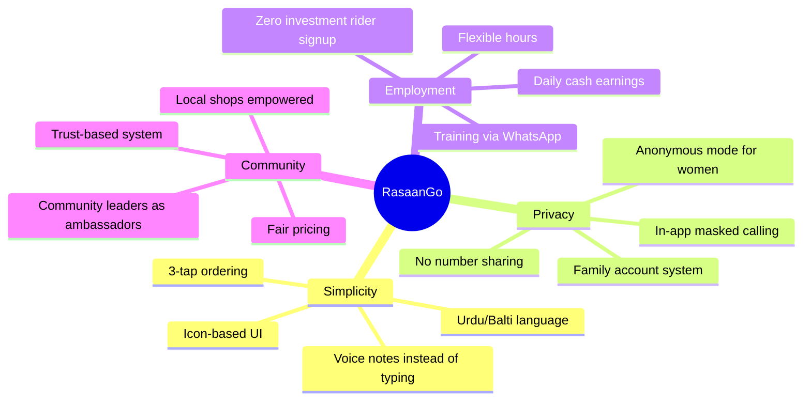
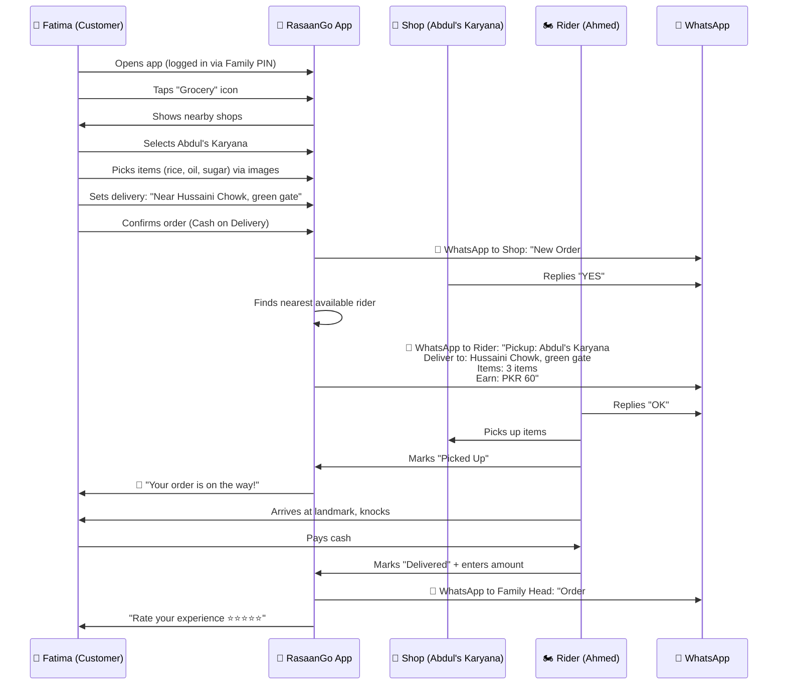
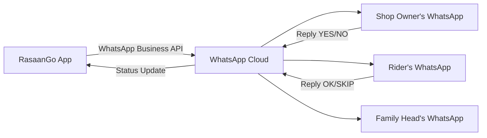

# 🚀 RasaanGo — Skardu Local Delivery App
### *"Har cheez, har jagah, har waqt — aapke darwaze par"*

> **App Name Suggestion:** **RasaanGo** (رسان گو) — "Rasaan" means delivery/supply in local context, "Go" is universal. Alternative: **PahunchGo**, **SkarduDash**, **MehmanDar**

---

## 📋 Table of Contents
1. [The Problem We're Solving](#1-the-problem)
2. [App Strategy & Vision](#2-strategy)
3. [Privacy-First Design for Women](#3-privacy)
4. [Job Creation Strategy](#4-jobs)
5. [Complete App Workflow](#5-workflow)
6. [User Roles & Journeys](#6-roles)
7. [Feature List](#7-features)
8. [UI/UX Design Plan](#8-uiux)
9. [Screen-by-Screen Breakdown](#9-screens)
10. [WhatsApp Integration](#10-whatsapp)
11. [Revenue Model](#11-revenue)
12. [Tech Stack](#12-tech)
13. [Launch Strategy](#13-launch)

---

## 1. The Problem We're Solving {#1-the-problem}

### Real Problems in Skardu & Neighboring Areas

| Problem | Impact | Our Solution |
|---------|--------|-------------|
| **Unemployment** (~60% uneducated) | Youth idle, no income source | Any person with a bike = instant job as rider |
| **Women can't share numbers** | They can't order or sell online | Anonymous ordering system, no phone number exposed |
| **No local delivery infra** | People waste hours going to bazaar | On-demand delivery from any shop |
| **Shops have no online presence** | Limited customer reach | Every shop gets free digital storefront |
| **Harsh winters** | Difficult to go out for groceries | Home delivery solves mobility issues |
| **Tourism season** | Tourists can't find local services | Tourists can order anything in their language |

---

## 2. App Strategy & Vision {#2-strategy}

### Core Philosophy
> **"Zero Barrier Entry"** — Anyone can use it. No education needed. No complex registration. Icon-based UI. Voice-note support. WhatsApp as the backbone.

### Strategic Pillars



### How It's Different from Foodpanda/Careem

| Feature | Foodpanda/Careem | RasaanGo |
|---------|-----------------|----------|
| **Scope** | Food only | ANYTHING — groceries, medicine, hardware, gas cylinder, clothes |
| **Target** | Urban educated | Rural/semi-urban, low literacy |
| **Rider Entry** | Documents, training, smartphone | Just a bike + basic phone + WhatsApp |
| **Privacy** | Number visible | Fully anonymous option |
| **Language** | English/Urdu | Urdu + Balti + icon-based |
| **Payment** | Card/wallet | Cash on delivery (primary) |
| **Shop Onboarding** | Complex contracts | WhatsApp catalog = your shop |

---

## 3. Privacy-First Design for Women/Families {#3-privacy}

> [!CAUTION]
> This is the MOST CRITICAL feature. If we don't solve this, we lose 50% of users and potential earners. This must be built into the CORE architecture, not as an afterthought.

### The Problem in Detail
- Women/girls **cannot share their phone numbers** with male riders or strangers
- Families are strict about **voice communication** with non-family males
- Women want to order items but **cultural norms prevent direct contact**
- Women want to earn (selling food, handicrafts) but **can't publicly list**

### Our Solutions — Privacy Architecture

#### Solution 1: 🔒 Anonymous Ordering Mode ("Parda Mode")
- User places order → system assigns **order ID only**
- Rider sees: **"Order #1234 — Deliver to [Area Name], [Landmark]"**
- Rider **NEVER** sees the customer's phone number
- Delivery confirmation via **door knock + leave at door** option
- OTP verification via **in-app notification only** (no SMS/call needed)

#### Solution 2: 📞 Masked Calling (Number Hiding)
- If rider must contact customer → routed through **masked number**
- Customer sees: "RasaanGo Rider calling" (not personal number)
- Call auto-disconnects after delivery completion
- **Alternative:** Text-only communication through in-app chat

#### Solution 3: 👨‍👩‍👧 Family Account System
```
┌─────────────────────────────────────┐
│         FAMILY ACCOUNT              │
│   Registered under: Father/Brother  │
│   Phone: Father's number            │
│                                     │
│   👤 Sub-users:                     │
│   ├── 🧕 Daughter (orders only)     │
│   ├── 🧕 Wife (orders + sells)     │
│   └── 👦 Son (orders + rides)      │
│                                     │
│   All notifications → Father's      │
│   WhatsApp. Sub-users use app       │
│   with PIN code, no phone needed.   │
└─────────────────────────────────────┘
```
- One family account, multiple sub-users
- Women access with **4-digit PIN** — no phone number registration
- All delivery confirmations go to the **family head's WhatsApp**
- Women can order without exposing any personal info

#### Solution 4: 🏪 Female-to-Female Delivery Option
- Women riders deliver to women customers (optional preference)
- Gradually build a network of **female riders** (bicycle/walking for nearby)
- Women sellers' products listed under **shop name only** (no personal details)

#### Solution 5: 📍 Landmark-Based Delivery (No Exact Address)
- Instead of home address: **"Near Jamia Masjid, blue gate house"**
- Rider delivers to **landmark** → customer comes out to collect
- Or: **"Leave at neighbor's shop [Abdul's Karyana]"** option

---

## 4. Job Creation Strategy {#4-jobs}

### Who Can Earn? (Employment Tiers)

```mermaid
graph TD
    A[RasaanGo Employment] --> B[🏍️ Riders]
    A --> C[🏪 Shop Partners]
    A --> D[🧕 Home Sellers]
    A --> E[📢 Area Ambassadors]
    A --> F[📞 Support Agents]
    
    B --> B1[Own bike/cycle]
    B --> B2[Earn per delivery]
    B --> B3[No education needed]
    B --> B4[Flexible hours]
    
    C --> C1[List products free]
    C --> C2[More customers]
    C --> C3[No commission first 3 months]
    
    D --> D1[Women sell from home]
    D --> D2[Food / handicrafts / embroidery]
    D --> D3[No number exposed]
    D --> D4[Anonymous shop names]
    
    E --> E1[Promote in their area]
    E --> E2[Earn per referral]
    E --> E3[Community leaders]
    
    F --> F1[Handle complaints]
    F --> F2[Part-time from home]
    F --> F3[WhatsApp-based support]
```



### Rider Economics
| Metric | Value |
|--------|-------|
| Avg delivery fee | PKR 50-100 |
| Rider gets | 80% of delivery fee |
| Avg deliveries/day | 10-15 |
| Daily earning potential | PKR 400-1200 |
| Monthly estimate | PKR 12,000-36,000 |
| Investment needed | PKR 0 (own bike) |

### Addressing the "60% Uneducated" Factor
1. **Icon-based rider app** — Big colored icons, no reading needed
2. **Voice guidance** — App speaks instructions in Urdu
3. **WhatsApp as backup** — Rider gets order details via WhatsApp message
4. **Training via video** — 5-minute WhatsApp video = you're ready
5. **Community training** — Existing riders teach new ones (earn bonus per trainee)

---

## 5. Complete App Workflow — Real Scenario {#5-workflow}

### Scenario 1: Fatima orders groceries (Anonymous Mode)



### Scenario 2: Zainab sells homemade food (Women Seller)

```
1. Zainab's brother registers Family Account
2. Zainab gets a sub-account → creates shop "Skardu Kitchen" 
3. She lists items with photos: Chapshoro, Momo, Mamtu
4. Customer orders Chapshoro × 5
5. Zainab gets notification (in-app only, no call)
6. She prepares food, packs it
7. Rider picks up from "her area landmark" 
8. Customer receives food
9. Money deposited to Family Account (brother's JazzCash/Easypaisa)
10. Zainab earned PKR 500 — never spoke to a stranger
```

### Scenario 3: Ahmed becomes a rider (Job Creation)

```
1. Ahmed has a bike but no job
2. Downloads RasaanGo → taps "Become Rider"
3. Enters: Name, CNIC photo, bike photo, WhatsApp number
4. Gets approved within 1 hour (local team verifies)
5. Watches 5-min training video on WhatsApp
6. Goes online → gets first delivery request
7. Completes delivery → earns PKR 70
8. Does 12 deliveries that day → earns PKR 840
9. Gets paid daily via JazzCash/Easypaisa
```

---

## 6. User Roles & Journeys {#6-roles}

### Three User Types in One App

| Role | Experience | Key Screens |
|------|-----------|-------------|
| 🛒 **Customer** | Browse → Order → Track → Receive | Home, Shop, Cart, Track, Rate |
| 🏍️ **Rider** | Go Online → Accept → Pickup → Deliver → Earn | Dashboard, Order Queue, Navigation, Earnings |
| 🏪 **Seller/Shop** | List Items → Get Orders → Prepare → Handoff | Shop Dashboard, Menu Manager, Order Alerts |

> [!IMPORTANT]
> All three roles exist in the SAME app. User switches role via bottom nav or settings. This keeps it simple — one download, multiple uses.

---

## 7. Feature List {#7-features}

### Phase 1 — MVP (Launch in 4-6 weeks)

#### Customer Features
- [ ] Icon-based category browsing (Grocery, Food, Medicine, Gas, General)
- [ ] Image-based product selection (minimal text)
- [ ] Voice note ordering ("Mujhe 5kg aata chahiye" — send voice note to shop)
- [ ] Landmark-based delivery address
- [ ] Anonymous mode (no number sharing)
- [ ] Family account with PIN sub-users
- [ ] Real-time order tracking (simple map)
- [ ] Cash on Delivery
- [ ] Order history
- [ ] Rating system (emoji-based: 😡😐😊🤩)

#### Rider Features
- [ ] One-tap go online/offline
- [ ] WhatsApp order notifications (backup)
- [ ] Voice navigation to pickup/delivery
- [ ] Earnings dashboard (daily/weekly)
- [ ] Accept/reject orders
- [ ] Delivery confirmation (photo proof)
- [ ] Daily payout tracking

#### Shop/Seller Features
- [ ] Simple photo-based product listing
- [ ] WhatsApp order alerts
- [ ] Accept/reject orders
- [ ] Business hours setting
- [ ] Basic sales report

### Phase 2 — Growth (Month 2-4)
- [ ] JazzCash/Easypaisa payment integration
- [ ] Scheduled deliveries
- [ ] Favorite shops/reorder
- [ ] Multi-language (Urdu, Balti, English)
- [ ] Female rider network
- [ ] Promotional offers system
- [ ] Shop search by product

### Phase 3 — Scale (Month 4-8)
- [ ] Expand to Gilgit, Chilas, Hunza
- [ ] Tourism mode (English UI + tourist-friendly categories)
- [ ] Bulk/wholesale ordering
- [ ] Subscription deliveries (daily milk, bread)
- [ ] In-app wallet
- [ ] Business analytics for shops

---

## 8. UI/UX Design Plan {#8-uiux}

### Design Principles

1. **Icon-First, Text-Second** — Every action has a big, colorful icon
2. **Maximum 3 Taps to Order** — Category → Shop → Confirm
3. **Big Buttons** — Designed for rough hands, outdoor use
4. **High Contrast** — Visible in Skardu's bright sunlight
5. **Offline-Friendly** — Core features work with poor connectivity
6. **RTL Ready** — Full Urdu support from day 1
7. **Culturally Appropriate** — Colors and imagery that resonate locally

### Color Palette

| Color | Hex | Usage |
|-------|-----|-------|
| **Mountain Green** | `#1B7A4E` | Primary brand, headers, CTAs |
| **Sky Blue** | `#3B82F6` | Links, rider mode accent |
| **Warm Amber** | `#F59E0B` | Seller mode, highlights, badges |
| **Snow White** | `#FAFAFA` | Backgrounds |
| **Dark Slate** | `#1E293B` | Text |
| **Soft Rose** | `#E11D48` | Alerts, urgency |
| **Warm Beige** | `#FEF3C7` | Anonymous mode indicator |

> Inspired by Skardu's landscape — mountains (green), sky (blue), sunshine (amber), snow (white)

### Typography
- **Primary:** Noto Nastaliq Urdu (for Urdu/Balti text)
- **Secondary:** Inter (for English, numbers)
- **Icon Set:** Custom illustrated icons with local flavor

### Component Philosophy
```
┌──────────────────────────────────┐
│  Big Category Card               │
│  ┌──────────┐                    │
│  │  🛒 Icon │  "Grocery"         │
│  │  (48px)  │  گروسری            │
│  └──────────┘                    │
│  Tap target: minimum 56px       │
│  Rounded: 16px                  │
│  Shadow: soft elevation         │
└──────────────────────────────────┘
```

---

## 9. Screen-by-Screen Breakdown {#9-screens}

### 📱 CUSTOMER SCREENS

#### Screen 1: Onboarding (First Open)
```
┌─────────────────────────┐
│                         │
│     🏔️ RasaanGo         │
│   "Skardu ki apni app"  │
│                         │
│  [🔹 شروع کریں / Start]│
│                         │
│  Language: [اردو] [Eng] │
│                         │
│  ────────────────────── │
│  "Koi account nahi?     │
│   Koi baat nahi!"       │
│                         │
│  [👤 Apna Account]      │
│  [👨‍👩‍👧 Family Account]   │
│  [👻 Guest / Anonymous] │
│                         │
└─────────────────────────┘
```

#### Screen 2: Home Screen (Customer)
```
┌──────────────────────────┐
│ 📍 Skardu  |  🔍  | 🔔  │
│──────────────────────────│
│ Assalam o Alaikum! 👋    │
│ Kya mangwana hai?        │
│──────────────────────────│
│                          │
│  ┌──────┐  ┌──────┐     │
│  │ 🛒   │  │ 🍕   │     │
│  │Grocery│  │ Food │     │
│  └──────┘  └──────┘     │
│  ┌──────┐  ┌──────┐     │
│  │ 💊   │  │ ⛽   │     │
│  │Medicine│ │ Gas  │     │
│  └──────┘  └──────┘     │
│  ┌──────┐  ┌──────┐     │
│  │ 🔧   │  │ 📦   │     │
│  │Hardware│ │Anything│   │
│  └──────┘  └──────┘     │
│                          │
│ ── Nearby Shops ──       │
│ [Shop Card] [Shop Card]  │
│                          │
│──────────────────────────│
│ 🏠  🔍  🛒  📋  👤       │
│ Home Search Cart Orders Me│
└──────────────────────────┘
```

#### Screen 3: Shop Page
```
┌──────────────────────────┐
│ ← Abdul's Karyana        │
│ ⭐ 4.8 | 📍 2km | 🕐 Open│
│──────────────────────────│
│                          │
│ [📸 Shop Photo Banner]   │
│                          │
│ Categories:              │
│ [All] [Aata] [Rice] [Oil]│
│                          │
│ ┌──────────────────────┐ │
│ │ 📸 Aata 10kg         │ │
│ │ PKR 1,200    [+ Add] │ │
│ └──────────────────────┘ │
│ ┌──────────────────────┐ │
│ │ 📸 Rice Basmati 5kg  │ │
│ │ PKR 800     [+ Add]  │ │
│ └──────────────────────┘ │
│                          │
│ 🎤 Voice Order:          │
│ [🎙️ Apni farmaish bolein]│
│                          │
│──────────────────────────│
│      [🛒 Cart - 2 items] │
└──────────────────────────┘
```

#### Screen 4: Cart & Checkout
```
┌──────────────────────────┐
│ ← Cart                   │
│──────────────────────────│
│                          │
│ Abdul's Karyana:         │
│ ┌────────────────────┐   │
│ │ Aata 10kg  [-1+]   │   │
│ │ PKR 1,200          │   │
│ ├────────────────────┤   │
│ │ Rice 5kg   [-1+]   │   │
│ │ PKR 800            │   │
│ └────────────────────┘   │
│                          │
│ Delivery Location:       │
│ 📍 [Hussaini Chowk,     │
│     green gate ke paas]  │
│                          │
│ 🔒 Anonymous Delivery?   │
│    [✅ Haan / ❌ Nahi]    │
│                          │
│ ── Summary ──            │
│ Items: PKR 2,000         │
│ Delivery: PKR 60         │
│ Total: PKR 2,060         │
│                          │
│ Payment: 💵 Cash         │
│                          │
│ [🟢 ORDER KAREIN]        │
└──────────────────────────┘
```

#### Screen 5: Order Tracking
```
┌──────────────────────────┐
│ ← Order #1234            │
│──────────────────────────│
│                          │
│     ✅ Order Confirmed    │
│         │                │
│     ✅ Shop Preparing     │
│         │                │
│     🔄 Rider on the way  │ ← Current
│         │                │
│     ⬜ Delivered          │
│                          │
│ ┌──────────────────────┐ │
│ │  🗺️ [Live Map View]  │ │
│ │  Rider: Ahmed 🏍️     │ │
│ │  ETA: 12 min          │ │
│ └──────────────────────┘ │
│                          │
│ [📞 Call Rider (Masked)] │
│ [💬 Chat with Rider]     │
│                          │
└──────────────────────────┘
```

---

### 🏍️ RIDER SCREENS

#### Rider Home
```
┌──────────────────────────┐
│ RasaanGo Rider           │
│──────────────────────────│
│                          │
│  Today's Earnings:       │
│  ┌──────────────────┐    │
│  │  💰 PKR 840      │    │
│  │  12 Deliveries    │    │
│  └──────────────────┘    │
│                          │
│  ┌──────────────────────┐│
│  │                      ││
│  │   🟢 ONLINE          ││
│  │   [Tap to go offline]││
│  │                      ││
│  └──────────────────────┘│
│                          │
│  Waiting for orders...   │
│  🏍️ ~~~                  │
│                          │
│──────────────────────────│
│ 🏠  📋  💰  👤            │
│ Home Orders Earn Profile │
└──────────────────────────┘
```

#### New Order Alert (Full Screen Popup)
```
┌──────────────────────────┐
│                          │
│  🔔 NEW ORDER!           │
│                          │
│  ┌──────────────────┐    │
│  │ Pickup: Abdul's   │   │
│  │ Karyana           │   │
│  │ 📍 1.2 km away    │   │
│  │                   │   │
│  │ Deliver to:       │   │
│  │ Hussaini Chowk    │   │
│  │ 📍 2.5 km total   │   │
│  │                   │   │
│  │ 💰 Earn: PKR 70   │   │
│  └──────────────────┘    │
│                          │
│  ⏰ Accept in 30s        │
│  [████████░░░░] 20s      │
│                          │
│  [🟢 ACCEPT]  [🔴 SKIP]  │
│                          │
└──────────────────────────┘
```

---

### 🏪 SELLER/SHOP SCREENS

#### Shop Dashboard
```
┌──────────────────────────┐
│ Abdul's Karyana          │
│──────────────────────────│
│                          │
│  Today:                  │
│  ┌────┐ ┌────┐ ┌────┐   │
│  │ 📦 │ │ 💰 │ │ ⭐ │   │
│  │ 23  │ │4.5k│ │4.8 │   │
│  │Orders│|Sales│|Rating│  │
│  └────┘ └────┘ └────┘   │
│                          │
│  🟢 Shop Open            │
│  [Toggle to Close]       │
│                          │
│  ── Active Orders ──     │
│  ┌──────────────────┐    │
│  │ #1234 - 3 items  │    │
│  │ [✅Accept] [❌Reject]│ │
│  └──────────────────┘    │
│  ┌──────────────────┐    │
│  │ #1235 - 1 item   │    │
│  │ Preparing... 🔄  │    │
│  └──────────────────┘    │
│                          │
│──────────────────────────│
│ 🏠  📦  📋  💰  ⚙️       │
│ Home Items Orders Money Set│
└──────────────────────────┘
```

---

## 10. WhatsApp Integration Strategy {#10-whatsapp}

### Why WhatsApp is the Backbone

| Reason | Explanation |
|--------|-------------|
| **100% penetration** | Everyone in Skardu has WhatsApp |
| **Trusted** | People trust WhatsApp, not unknown apps |
| **Low data** | Works on 2G/slow connections |
| **Voice notes** | Illiterate users can send voice orders |
| **No learning curve** | Everyone already knows how to use it |

### Integration Architecture



### WhatsApp Message Templates

**To Shop (New Order):**
```
🛒 *RasaanGo — Naya Order!*

Order #1234
📦 Items:
• Aata 10kg - 1
• Cooking Oil 1L - 2  
• Sugar 2kg - 1

💰 Total: PKR 2,000

Accept karein? 
Reply: *YES* ya *NO*
```

**To Rider (New Delivery):**
```
🏍️ *RasaanGo — Delivery!*

Pickup: Abdul's Karyana, Main Bazaar
📍 maps.google.com/xxxxx

Deliver to: Hussaini Chowk, green gate
📍 maps.google.com/xxxxx

💰 Aap ka earning: PKR 70

Reply: *OK* to accept
```

**To Family (Order Confirmation):**
```
✅ *RasaanGo — Order Delivered!*

Order #1234
Items: 3 groceries
Amount: PKR 2,060 (incl. delivery)
Delivered by: Ahmed ⭐4.9

Thank you! 🙏
```

---

## 11. Revenue Model {#11-revenue}

### Phase 1 (Month 1-3): Free Launch
- **Zero commission** on all orders
- Focus on adoption and trust building
- Funded by initial investment

### Phase 2 (Month 4-6): Gentle Monetization
| Revenue Stream | Amount | From |
|---------------|--------|------|
| Delivery fee | PKR 40-100 per order | Customer |
| Platform fee | 5% per order | Shop |
| Priority listing | PKR 500/month | Shop |
| Promoted products | PKR 50/day per product | Shop |

### Phase 3 (Month 6+): Sustainable
- Increase platform fee to 8-10%
- Subscription for riders (PKR 200/month for priority orders)
- Advertisement space in app
- Partnership with brands for promotions

---

## 12. Technology Stack {#12-tech}

### Frontend (Mobile App)
| Technology | Purpose |
|-----------|---------|
| **React Native** | Cross-platform (iOS + Android) |
| **Expo** | Fast development, OTA updates |
| **React Navigation** | Screen navigation |
| **React Native Maps** | Live tracking |
| **AsyncStorage** | Offline data |
| **i18next** | Urdu/English/Balti localization |
| **React Native Reanimated** | Smooth animations |

### Backend
| Technology | Purpose |
|-----------|---------|
| **Node.js + Express** or **Laravel** | REST API |
| **PostgreSQL** | Main database |
| **Redis** | Caching, real-time data |
| **Socket.io** | Real-time order tracking |
| **Firebase Cloud Messaging** | Push notifications |
| **WhatsApp Business API** | Messaging backbone |
| **Twilio** | Masked calling |

### Infrastructure
| Service | Purpose |
|---------|---------|
| **AWS / DigitalOcean** | Cloud hosting |
| **Cloudflare** | CDN, security |
| **S3** | Image storage |
| **GitHub Actions** | CI/CD |

### Project Structure (React Native)
```
RasaanGo/
├── src/
│   ├── screens/
│   │   ├── customer/        # Customer screens
│   │   │   ├── HomeScreen.tsx
│   │   │   ├── ShopScreen.tsx
│   │   │   ├── CartScreen.tsx
│   │   │   ├── TrackingScreen.tsx
│   │   │   └── OrderHistoryScreen.tsx
│   │   ├── rider/           # Rider screens  
│   │   │   ├── RiderHomeScreen.tsx
│   │   │   ├── OrderAlertScreen.tsx
│   │   │   ├── DeliveryScreen.tsx
│   │   │   └── EarningsScreen.tsx
│   │   ├── seller/          # Shop/Seller screens
│   │   │   ├── ShopDashboard.tsx
│   │   │   ├── ItemManager.tsx
│   │   │   └── OrdersScreen.tsx
│   │   ├── auth/
│   │   │   ├── OnboardingScreen.tsx
│   │   │   ├── LoginScreen.tsx
│   │   │   └── FamilyAccountScreen.tsx
│   │   └── common/
│   │       ├── ProfileScreen.tsx
│   │       └── SettingsScreen.tsx
│   ├── components/
│   │   ├── CategoryCard.tsx
│   │   ├── ProductCard.tsx
│   │   ├── OrderCard.tsx
│   │   ├── VoiceRecorder.tsx
│   │   ├── AnonymousToggle.tsx
│   │   └── MaskedCallButton.tsx
│   ├── navigation/
│   │   ├── CustomerNavigator.tsx
│   │   ├── RiderNavigator.tsx
│   │   ├── SellerNavigator.tsx
│   │   └── RootNavigator.tsx
│   ├── services/
│   │   ├── api.ts
│   │   ├── whatsapp.ts
│   │   ├── location.ts
│   │   ├── notifications.ts
│   │   └── auth.ts
│   ├── store/              # State management
│   │   ├── authStore.ts
│   │   ├── orderStore.ts
│   │   └── cartStore.ts
│   ├── i18n/               # Translations
│   │   ├── ur.json         # Urdu
│   │   ├── en.json         # English
│   │   └── blt.json        # Balti
│   ├── theme/
│   │   ├── colors.ts
│   │   ├── typography.ts
│   │   └── spacing.ts
│   └── utils/
│       ├── privacy.ts      # Anonymization helpers
│       ├── maskedCall.ts
│       └── helpers.ts
├── assets/
│   ├── icons/
│   ├── images/
│   └── fonts/
├── app.json
└── package.json
```

---

## 13. Launch Strategy {#13-launch}

### Pre-Launch (Week 1-2)
1. **Identify 5 pilot shops** in Skardu Main Bazaar
2. **Recruit 10 riders** — start with friends/family
3. **Community meeting** with local leaders for trust building
4. **Create WhatsApp group** — "RasaanGo Skardu Riders"
5. **Masjid announcements** — culturally appropriate awareness

### Soft Launch (Week 3-4)
1. Launch in **1 area only** (e.g., Main Bazaar ↔ Hussainabad)
2. **Free delivery** first 100 orders
3. Every rider shares with 5 friends
4. Collect feedback aggressively

### Full Launch (Month 2)
1. Expand to all Skardu areas
2. Add more shop categories  
3. Launch women seller program
4. **Mosque + school poster campaign**
5. WhatsApp status marketing (riders share their earnings)

### Growth Hacks
- **Rider referral:** PKR 100 bonus per new rider who completes 10 deliveries
- **Shop referral:** 1 month free for shops that bring 3 more shops
- **Social proof:** Daily "Today's Top Rider" WhatsApp status
- **Seasonal push:** Heavy push before Ramadan and tourist season

---

## Summary — Why This Will Work in Skardu

| Factor | Our Advantage |
|--------|--------------|
| **Trust** | WhatsApp-based, local riders, community-endorsed |
| **Simplicity** | Icon-based, voice notes, 3-tap ordering |
| **Privacy** | Anonymous mode, masked calls, family accounts |
| **Jobs** | Zero investment, daily earnings, flexible hours |
| **Need** | Harsh winters, limited transport, underserved market |
| **First mover** | No competitor in Skardu doing this |

> [!TIP]
> **Start small, grow fast.** The goal is 50 orders/day within the first month, 200/day by month 3. With each successful delivery, trust grows exponentially in a close-knit community like Skardu.

---

*This document is the strategic foundation. Ready to proceed with React Native development when approved.* 🚀
